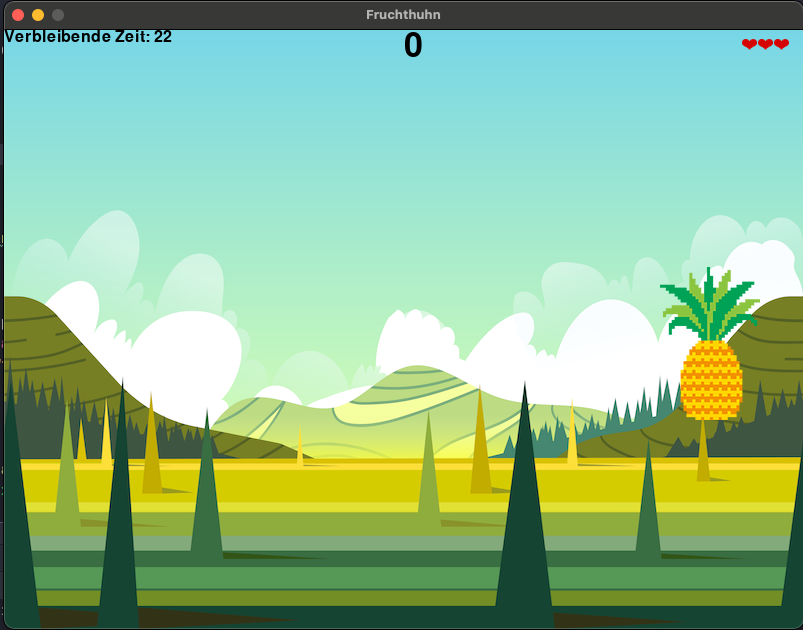
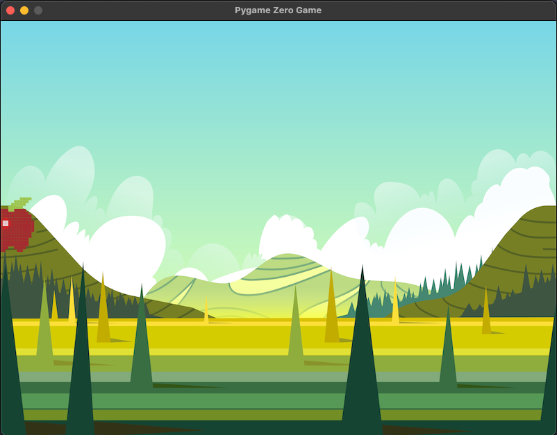

# Fruchthuhn

Mit Hilfe von [pygamezero](https://pygame-zero.readthedocs.io/de/latest/introduction.html) bauen wir uns unsere eigene Version des Klassikers Moorhuhn.




## Voraussetzungen

Klone dieses Repository oder lade dir das [Release](https://github.com/Devoxx4KidsDE/python-games/archive/refs/tags/9bec350.zip) herunter und entpacke es.

Begib dich mit einer Shell in das Verzeichnis und installiere alles was python braucht mit: 
````commandline
python -m pip install -r requirements.txt
````


## Inhalt
 
Das Projekt beinhaltet mehrere Versionen des Spiels, angefangen bei `1_Fruchthuhn_base` was die
Basics für dieses Spiel enthält.

Jede weitere Datei erweitert die vorherige Spieleversion um ein Detail.
Zum Beispiel wird in `2_Fruchthuhn_punktestand` der Punktestand im Spiel angezeigt.

In der ersten Version sieht das Spiel noch so aus:

* `1_Fruchthuhn_base` - Basic Spiel Früchte können angeklickt werden
* `2_Fruchthuhn_punktestand` - Das Base Spiel wird um einen Punktestand erweitert
* `3_Fruchthuhn_mehr_fruechte` - Zeige verschiedene Früchte an
* `4_Fruchthuhn_timer` - Füge dem Spiel einen Timer hinzu
* `5_Fruchthuhn_neustart` - Das Spiel wird neustartbar
* `6_Fruchthuhn_leben` - Der Spieler bekommt 3 Leben
* `7_Fruchthuhn_bewegende_fruechte` - Die Früchte bewegen sich in eine Richtung
* `8_Fruchthuhn_tanzende_fruechte` - Lass die Früchte tanzen


## Weitere Ideen

Alles geschafft? Dann bring doch deine eigenen Ideen ein oder lass dich inspirieren:
* Zeige mehrere Früchte auf einmal an
* Zeige einen Treffer im Spiel an anstatt auf der Konsole
* Verschiedene Früchte geben unterschiedlich viele Punkte
* Verschiedene Bewegungsart je Frucht
* Lass andere Dinge als Früchte auftauchen, die dem Spieler keine Punkte geben, aber Leben verlieren lassen

Bei Fragen stehen wir dir gerne zur Seite

Kontakt: info@devoxx4kids.de